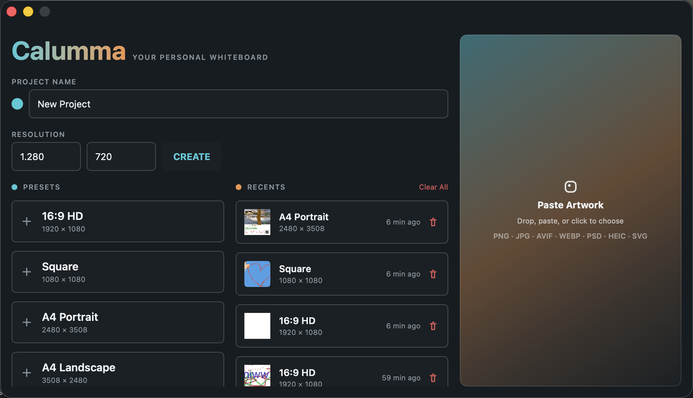
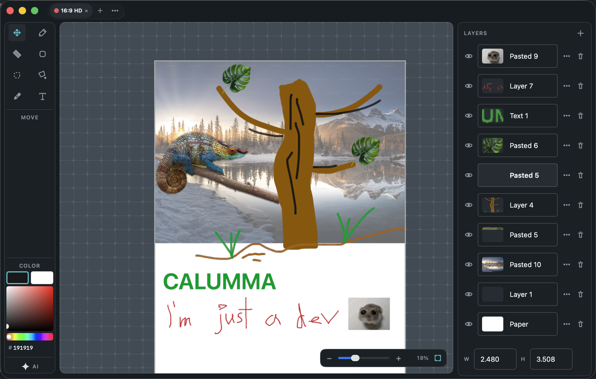

# Calumma v2

**Your personal whiteboard** — bounded canvases you draw on with a pen, shapes, and text.
Layers, masks, and workspaces keep projects organized; everything persists locally.

Native macOS app: SwiftUI shell, Rust/wgpu engine, SQLite storage.

<p align="center">
  
</p>

<p align="center">
  
</p>

Read **`AGENTS.md`**, **`FLOW.md`**, and **`design/STYLE.md`**.

## Quick start

```bash
./manage.py tokens   # regenerate Swift tokens from design/tokens.json
./manage.py examples # optimize design/example/*.png (drop sources in design/example/source/)
./manage.py dev      # build ffi + open Xcode
./manage.py package  # Release build → dist/Calumma-<version>.dmg
```

Run the **Calumma** scheme. Landing → create/preset/recent → editor with top tabs.

## Layout

| Path | Role |
| --- | --- |
| `design/` | visual tokens, STYLE, SVG icons, README screenshots (`design/example/`) |
| `FLOW.md` | product flow: screens, shortcuts, import/export |
| `translations/` | UI locale JSON (`en` today) |
| `engine/` | Cargo workspace (`Cargo.toml`, rustfmt, clippy) + crates |
| `engine/core` | document, tiles, camera, history, shapes |
| `engine/io` | SQLite projects |
| `engine/ops` | AI/image op registry (Cut BG shipped; see AGENTS) |
| `engine/render` | wgpu (surface from shell) |
| `engine/ffi` | C ABI for Swift |
| `platform/macos` | SwiftUI shell + `.swift-format` |
| `manage.py` | Python 3.14 task runner |
| `cli/` | Python helpers + leaf tools used by `manage.py` |

## Install (macOS)

Grab the latest `Calumma-<version>.dmg` from
[Releases](https://github.com/JanezSedeljsak/calumma-v2/releases), open it, and drag
**Calumma** into **Applications**. Apple Silicon, macOS 26+.

Builds are ad-hoc signed rather than notarized, so the first launch needs
right-click → **Open** (or `xattr -dr com.apple.quarantine /Applications/Calumma.app`).

A `v*` tag push publishes a release; `release.yml` can also be dispatched manually to
produce a prerelease or a plain workflow artifact.

## Notes

- Projects: OS-native app-data dir + `Calumma/calumma.sqlite` (`ProjectStore::default_path`,
  via the `dirs` crate — `~/Library/Application Support/Calumma/…` on macOS,
  `~/.local/share/Calumma/…` on Linux, `%APPDATA%\Calumma\…` on Windows)
- Tab switch clean-loads from DB (no preload)
- Shell knobs only; canvas/state in Rust
- Custom icons only; no icon libraries
